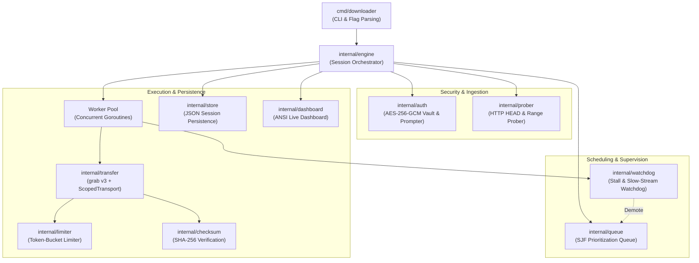
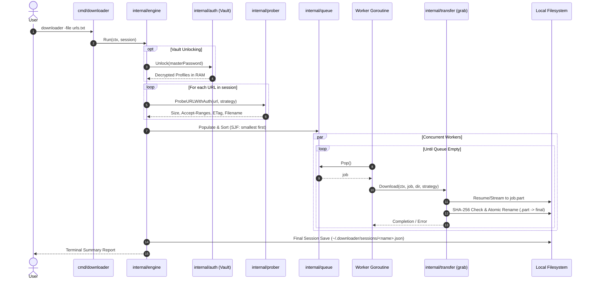

# Architecture & Repository Design

This document details the internal architecture, subsystem design, data flow, concurrency model, and security principles of the Go Concurrent Resumable Downloader.

For instructions on building the project, see [BUILD.md](BUILD.md).  
For user-facing CLI usage and examples, see the root [README.md](../README.md).

---

## 1. High-Level Architecture

The downloader is organized into modular packages under `internal/`, coordinated by the `engine` package, with the CLI entry point situated in `cmd/downloader`.

---

## 2. Component Breakdown

| Package | Path | Purpose & Responsibility |
| :--- | :--- | :--- |
| **`main`** | [`cmd/downloader`](../cmd/downloader/README.md) | Parses command-line flags, dispatches subcommands (`list`, `resume`, `status`, `auth`), reads `urls.txt`, and manages terminal signals. |
| **`auth`** | [`internal/auth`](../internal/auth/README.md) | Encrypted credential vault (AES-256-GCM + PBKDF2), domain-scoped transport, cross-domain redirect header sanitization, and typed error mapping. |
| **`checksum`** | [`internal/checksum`](../internal/checksum/README.md) | Computes and validates SHA-256 hashes for downloaded files before final promotion. |
| **`dashboard`** | [`internal/dashboard`](../internal/dashboard/README.md) | Dual-mode progress renderer: interactive multi-line ANSI terminal dashboard for TTYs, clean fallback interval logger for headless pipes/CI. |
| **`engine`** | [`internal/engine`](../internal/engine/README.md) | Coordinates the end-to-end lifecycle: probing, queue population, worker pooling, session persistence, and graceful termination. |
| **`limiter`** | [`internal/limiter`](../internal/limiter/README.md) | Token-bucket rate limiter implementing both `io.Reader` wrapping and the `grab.RateLimiter` interface. |
| **`model`** | [`internal/model`](../internal/model/README.md) | Domain types, status enums (`PENDING`, `DOWNLOADING`, `COMPLETED`, `FAILED`, `PAUSED`, `DEMOTED`), session structs, and unit formatters. |
| **`prober`** | [`internal/prober`](../internal/prober/README.md) | Pre-flight inspector querying endpoints via HTTP `HEAD` or fallback `Range: bytes=0-0` to obtain file size, range support, and RFC 5987/6266 filenames. |
| **`queue`** | [`internal/queue`](../internal/queue/README.md) | Thread-safe Shortest-Job-First (SJF) priority queue with dynamic demotion mechanics. |
| **`store`** | [`internal/store`](../internal/store/README.md) | Atomic JSON persistence for session files in `~/.downloader/sessions`. |
| **`transfer`** | [`internal/transfer`](../internal/transfer/README.md) | High-throughput streaming and partial resumption powered by `cavaliergopher/grab/v3`, enforcing domain-scoped authentication and atomic `.part` promotion. |
| **`watchdog`** | [`internal/watchdog`](../internal/watchdog/README.md) | Active stream health monitor detecting stalled streams (15s inactivity) and relative bandwidth degradation (<2/3 peer average). |

---

## 3. Data Flow & Download Lifecycle

---

## 4. Subsystem Deep-Dive

### 4.1. Security & Authentication (`internal/auth`)

#### Master-Password Encrypted Vault (`vault.enc`)
- **File Layout**:
  - `[0..8]`: Magic header `DLVAULT1`.
  - `[8..40]`: 32-byte cryptographically random salt (`crypto/rand`).
  - `[40..52]`: 12-byte random initialization vector (IV / Nonce).
  - `[52..End]`: AES-256-GCM ciphertext + 16-byte authentication tag.
- **Key Derivation**: PBKDF2-HMAC-SHA256 with 100,000 iterations.
- **Tamper Resistance**: AES-256-GCM authenticated encryption guarantees that file corruption or wrong passwords fail immediately with `ErrInvalidMasterPassword`.
- **Zero Plaintext on Disk**: Unlocked profiles and tokens reside exclusively in volatile RAM.

#### Anti-Leak Scoped Transport
When downloading from protected endpoints (such as GitLab package registries or private GitHub releases), responses frequently issue `302 Found` redirects to presigned Cloud storage URLs (e.g. AWS S3, Cloudflare R2, or Google Cloud Storage).

If authorization headers are forwarded to AWS S3 presigned URLs, S3 rejects the request with HTTP 400 (`InvalidArgument: Only one auth mechanism allowed`).

`ScopedTransport` and `NewRedirectHandler` enforce strict domain scoping:
1. `IsSameDomain(req.URL.Host, primaryTargetHost)` verifies origin match (normalizing host and port).
2. If navigating cross-domain, `Authorization`, `Proxy-Authorization`, `Cookie`, `X-API-Key`, and custom auth headers are scrubbed before transmission.

---

### 4.2. Shortest-Job-First (SJF) Scheduling (`internal/queue`)

The queue minimizes average wait times across batch downloads:
1. **Known Small Files First**: Jobs sorted ascending by `TotalSize`.
2. **Resumed Jobs Priority**: If a file was partially downloaded, its *remaining* bytes are considered for prioritization.
3. **Unknown Size at Tail**: Files whose size could not be determined during probing (`TotalSize == -1`) are scheduled after all known files.

---

### 4.3. Adaptive Watchdog & Dynamic Demotion (`internal/watchdog`)

A pool of concurrent workers can become starved if one worker is tied up on an unresponsive or extremely slow connection.

The `Watchdog` evaluates active transfers every second:
- **Warmup Grace Period**: Newly started streams are granted a 10-second warmup period (`StateWarmingUp`) where speed checks are suppressed.
- **Stall Detection**: If no bytes are received for 15 seconds, the stream transitions to `StateStalled`, its context is canceled, and the job is returned to the queue.
- **Chronic Degradation Detection**: If peer workers are transferring at an average speed $S_{avg}$, and a stable stream drops below $\frac{2}{3} S_{avg}$ for sustained windows, the watchdog cancels the worker stream, demotes the job to the tail of the queue, and lets another job take over the worker slot.
- **Anti-Churn Guard**: A job can only be demoted once (`DemotedOnce = true`). On its second run, it is allowed to finish regardless of peer throughput.

---

### 4.4. Streaming Engine & Resumption (`internal/transfer`)

`internal/transfer` integrates `cavaliergopher/grab/v3` while decoupling site-specific logic:
- **Resumption**: Inspects `.part` files on disk. If present, grab automatically issues HTTP `Range: bytes=<existing>-`.
- **Atomic File Placement**: All downloads are streamed to `.part` files and renamed to the final destination only upon successful download and checksum verification.
- **Rate Limiting**: Plugs into `internal/limiter`, satisfying `grab.RateLimiter` via token-bucket pacing.

---

## 5. Thread Safety & Concurrency

- **`FileJob` Synchronization**: `FileJob.mu` (an `RWMutex`) synchronizes concurrent updates to `DownloadedBytes`, `CurrentSpeed`, and `StreamState` between grab worker goroutines, the watchdog monitor, and the terminal dashboard renderer.
- **`Queue` Synchronization**: A dedicated mutex guards queue slices, with thread-safe `Pop()`, `Push()`, and `Demote()` primitives.
- **`Vault` Synchronization**: An `RWMutex` serializes access to in-memory profile maps and atomic disk rewrites.
- **Signal Handling**: OS interrupt signals (`SIGINT`, `SIGTERM`) propagate gracefully through root `context.Context` cancellation, allowing active transfers to flush `.part` buffers to disk before exiting.
